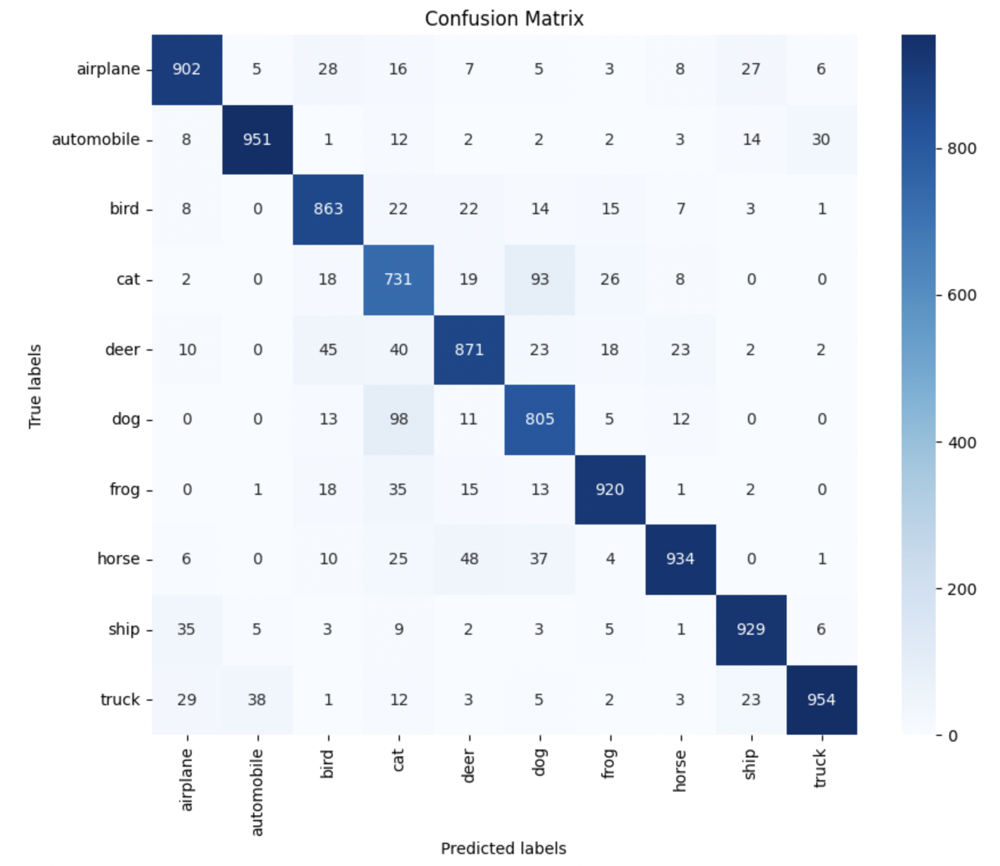

## CIFAR-10 CNN Image Classifier
<div align="center">
  <p>
    
    
    
    
    
  </p>
  <p>
    
    
    
    
    
  </p>
</div>


This repository contains a step-by-step exploration of convolutional neural network (CNN) architectures and transfer learning approaches for CIFAR-10 image classification, culminating in a best model that achieves around 88–89% test accuracy. The full experimentation process, code, and results are documented in the notebook `main.ipynb`.

Demo: [CIFAR-10 Demo](https://maleckicoa.com/demo-apps/cifar-10).

### Dataset
- **CIFAR-10**: 60,000 color images of size 32×32 in 10 classes (50,000 train / 10,000 test).
- Inputs normalized to [0, 1]; labels one-hot encoded.

## How to run

### Option A: Run on Google Colab (recommended)
1. Open `main.ipynb` in Google Colab.
2. Runtime → Change runtime type → set Hardware accelerator to GPU (A100/V100 if available).
3. Run all cells. The notebook includes everything needed (dataset download, training, evaluation, and plots).

### Option B: Run locally (CPU/GPU)
Requirements:
- Python 3.11+

Install core dependencies (CPU):

```bash
python -m venv .venv && source .venv/bin/activate
pip install --upgrade pip
pip install tensorflow numpy matplotlib seaborn scikit-learn
```

Then open and run `main.ipynb` with Jupyter or VS Code.


## Experiment log and model evolution
All experiments are implemented and runnable in `main.ipynb`. Below is a concise summary of how the models and training setup evolved to reach the best results.

### M1 — Baseline small CNN (~55% test acc)
- Architecture: `Conv(32, 3×3)` → `MaxPool` → `Flatten` → `Dense(100)` → `Dense(10)`
- Optimizer: SGD; Epochs: 50; Batch size: 512
- Takeaway: Too shallow and under-parameterized; limited feature extraction.

### M2 — Two conv layers (~58% test acc)
- Architecture: `Conv(32)` → `Conv(32)` → `MaxPool` → `Flatten` → `Dense(128)` → `Dense(10)`
- Optimizer: SGD; Epochs: 50; Batch size: 512
- Takeaway: Adding depth helps, but still not enough capacity/regularization.

### M4 — Deeper CNN with dropout (~78% test acc)
- Architecture:
  - Block 1: `Conv(32)` → `Conv(32)` → `MaxPool` → `Dropout(0.2)`
  - Block 2: `Conv(64)` → `Conv(64)` → `MaxPool` → `Dropout(0.2)`
  - Head: `Flatten` → `Dense(128)` → `Dropout(0.5)` → `Dense(10)`
- Optimizer: Adam (lr=1e-3); Epochs: 50; Batch size: 512
- Takeaway: More depth + dropout significantly improves generalization.

### M5 — Transfer learning with VGG16 at 64×64 (~67% test acc)
- Resize inputs to 64×64; use `VGG16(include_top=False, weights="imagenet")` frozen + small dense head.
- Optimizer: SGD (lr=1e-3, momentum=0.9, nesterov=True); Epochs: 20; Batch size: 64
- Takeaway: With frozen backbone and small input size, gains are modest on CIFAR-10.

### M6 — VGG-style custom + augmentation + batch norm (~82–83% test acc)
- Augmentation: `RandomContrast`, `RandomFlip(horizontal)`, `RandomRotation`
- Architecture:
  - Blocks: two `Conv(64)`, two `Conv(128)`, two `Conv(256)` each followed by `MaxPool` and `BatchNorm`
  - Head: `Flatten` → `Dense(128)` → `Dropout(0.5)` → `Dense(10)`
- Optimizer: Adam; Epochs: 25; Batch size: 512
- Result: ~82.5% test accuracy.
- Takeaway: Data augmentation + batch normalization markedly improve performance when training from scratch.

### M7 — Transfer learning with MobileNetV2 + fine-tuning (best: ~88–89% test acc)
- Preprocessing: resize to 96×96; normalize to [0, 1]
- Augmentation: `ImageDataGenerator` with rotation/shift/flip
- Backbone: `MobileNetV2(include_top=False, weights="imagenet")`
  - Phase 1: freeze backbone, train added head
  - Phase 2: unfreeze and fine-tune last ~50 layers of the backbone
- Head: `GlobalAveragePooling2D` → `Dropout(0.4)` → `Dense(256, relu)` → `Dropout(0.4)` → `Dense(10, softmax)`
- Optimizer: Adam; Phase 1 lr=1e-4, Phase 2 lr=1e-5
- Callbacks: EarlyStopping, ReduceLROnPlateau, ModelCheckpoint
- Result: ~0.886 validation/test accuracy; best checkpoint saved as `mobilenetv2_cifar10_best.keras`
- Takeaway: Modern lightweight backbones pretrained on ImageNet + careful fine-tuning yield the strongest results on CIFAR-10 in this workflow.

## Results at a glance (Accuracy)
- M1: ~55%
- M2: ~58%
- M4: ~78%
- M5 (VGG16 frozen): ~67%
- M6 (VGG-style + aug + BN): ~82–83%
- M7 (MobileNetV2 + fine-tune): ~88–89% (best)

Confusion matrices and training/validation curves for key models are generated in `main.ipynb`.


## Files
- `main.ipynb`: Complete end-to-end workflow (data, models, training, evaluation, plots).
- `mobilenetv2_cifar10_best.keras`: Saved best checkpoint (created when running the notebook with ModelCheckpoint).

## Hardware
Training was primarily run on Google Colab with a single A100 GPU. CPU runs are possible but much slower; GPU is recommended for the larger models and transfer learning stages.

## Frontend
To see the model in action, please visit the live demo: [CIFAR-10 Demo](https://maleckicoa.com/demo-apps/cifar-10).

## License
MIT